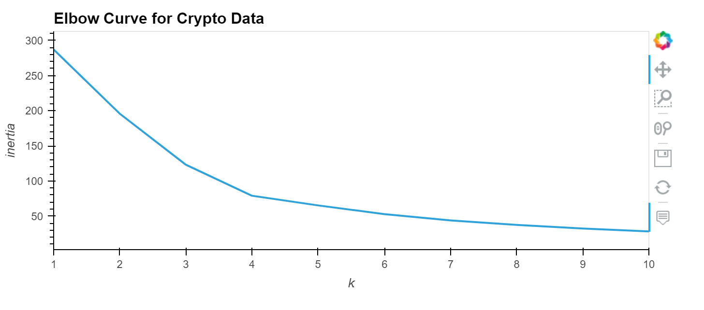
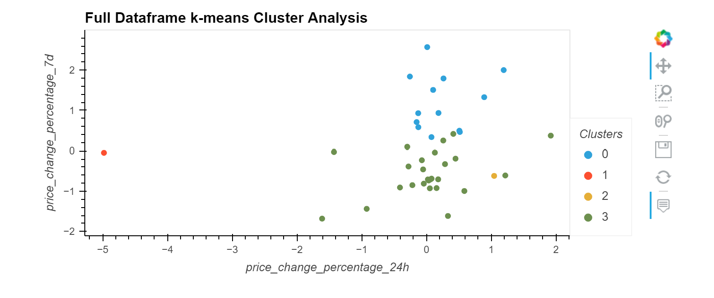
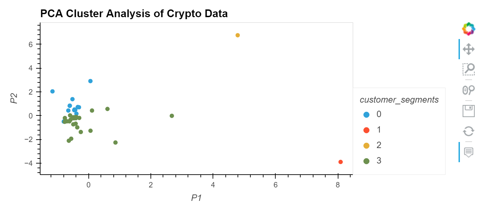

# Clustering_Crypto
Utilizes k-means clustering, the elbow method and principal component analysis to find significant clustering in crypto currency data before and after dimensional reduction


---

## Technologies

Language: Python 3.9.12

Libraries used:

[Pandas](https://pandas.pydata.org/pandas-docs/stable/index.html) - For the creation and visualization of Data Frames

[Jupyter Labs](https://jupyter.org/) - An ipython kernel for interactive computing in python

[PyViz hvPlot](https://hvplot.holoviz.org/index.html) - A high level python library for interactive data visualization

[SKLearn](https://scikit-learn.org/stable/) - Simple and effective python library for predictive data analysis


---

## Installation Guide

If you are using an anaconda or a conda environment chances are pandas, hvplot and jupyter labs are already installed in your virtual environment. In addition, installing scikit learn will be necessary

For a full install activate a conda development environment and run in GitBash if not already installed:
```python
    conda install pandas
    conda install jupyterlab
    conda install -c pyviz hvplot
```

To install the other dependencies not included in the anaconda environment run:
```python
    pip install -U scikit-learn
```

Check the to make sure everything has been installed properly
```python
    conda list pandas
    conda list hvplot
    conda list jupyter lab
    conda list scikit-learn
```

---

## Usage

To run this jupyter lab notebook you will need to use GitBash and navigate to where you have exported the files associated with this project and activate your dev environment.
Next, this project can be ran by navigating to the **crypto_investments.ipynb** jupyter notebook file and clicking the double arrow as seen below:


This will run the jupyter notebook and each cell has proper pseudocode directing the viewer as to which analyses are being shown. Additionally, the markdown cells provided also clue the reader in to what is going on.

There are a few interactive graphs along the way.


---

## Highlights:

### First the clustering is chosen using the elbow curve method which is used to train a model to cluster the full dataset



### Plot of clusters from full dataset



### Next, a PCA analysis is run to dimensionally reduce the crypto data and is plotted below




---

## Contributors

Created by Silvano Ross while in the UW FinTech Bootcamp
> Contact Info:
> email: silvanoross3@gmail.com |
> [GitHub](https://github.com/silvanoross) |
> [LinkedIn](https://www.linkedin.com/in/silvano-ross-b6a15a93/)

---

## License

[MIT](LICENSE)


